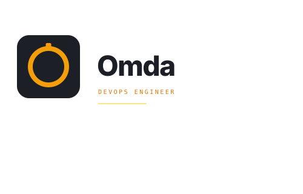

<div align="center">

<picture>
  <source media="(prefers-color-scheme: dark)" srcset="logo/omda-lockup-dark.svg">
  <source media="(prefers-color-scheme: light)" srcset="logo/omda-lockup-full.svg">
  
</picture>

<br/>

[](https://git.io/typing-svg)

<br/>

[](https://www.linkedin.com/in/omdamukhtar/)
[](https://emadmukhtar.com)
[](mailto:abuoop123@gmail.com)
[-FF6B35?style=flat-square&logo=googlemaps&logoColor=white>)](https://www.timeanddate.com/worldclock/uae/dubai)

</div>

---

## About Me

DevOps & Platform Engineer based in **Dubai, UAE** with 5+ years building production-grade cloud infrastructure, CI/CD automation, and SRE-driven reliability systems.

At **Ibrahim Al Zarooni Group**, I led the full transformation from FileZilla-based manual deployments to a Git-driven, Jenkins-automated, ChatOps-triggered delivery model - reducing manual release effort by **~80%** and achieving **99.9% service availability**.

I build systems I'd trust at 3AM during an incident.

---

## Certifications

| Certification                                            | Issuer                  | Status    |
| -------------------------------------------------------- | ----------------------- | --------- |
| 🏆 **AWS Certified DevOps Engineer – Professional**      | Amazon Web Services     | ✅ Earned |
| 🏆 **Red Hat Certified System Administrator (RHCSA 9)**  | Red Hat                 | ✅ Earned |
| 🏆 **Red Hat Certified Engineer (RHCE 294)**             | Red Hat                 | ✅ Earned |
| 🏆 **Certified Kubernetes Administrator (CKA)**          | CNCF / Linux Foundation | ✅ Earned |
| 🏆 **Red Hat Certified OpenShift Administrator (EX280)** | Red Hat                 | ✅ Earned |
| 📚 **SRE Fundamentals**                                  | Google via Uplimit      | ✅ Earned |

---

## Core Stack

<div align="center">

[](https://skillicons.dev)

</div>

<br/>

**Cloud & Infrastructure**
`AWS` `Amazon EKS` `VPC` `IAM` `CodePipeline` `CodeDeploy` `CodeBuild` `Elastic Beanstalk`

**Containers & Orchestration**
`Docker` `Kubernetes` `OpenShift` `Proxmox`

**CI/CD & Automation**
`Jenkins` `GitHub Actions` `GitLab CI` `Git`

**Infrastructure as Code**
`Terraform` `CloudFormation` `Ansible`

**Observability & Reliability**
`Prometheus` `Grafana` `Loki` `Promtail` `Datadog` `Uptime Kuma` `SLOs` `SLIs` `Error Budgets` `p99 Latency`

**Linux & Systems**
`RHEL` `Ubuntu` `Bash` `Shell Scripting` `Rsyslog` `Fail2Ban` `UFW` `mTLS`

**ChatOps & AI Tooling**
`Mattermost` `LangChain` `LLM-powered bots` `Jenkins trigger bots`

**Security**
`OWASP` `Burp Suite` `WAF` `Security Groups` `NACLs` `SSH hardening` `sysctl kernel tuning`

**Languages**
`Python` `Bash` `PHP` `JavaScript` `SQL`

---

## Key Projects

### 🔐 AWS WAF Logging with Terraform

End-to-end AWS security infrastructure - WAF + ALB + EC2 ASG + S3 logging, built with modular Terraform. Simulates real-world attack patterns (XSS, path traversal, `.env` exposure) and captures WAF decisions to S3 for security reporting.
→ [`aws-waf-logging`](https://github.com/OmdaMukhtar/aws-waf-logging)

### 🚀 Jenkins + Docker + Ansible CI/CD Pipeline

Full CI/CD pipeline for a Vue.js application: Jenkins orchestration, Docker containerization, Ansible agentless deployment, DAST security scanning integrated into the pipeline, zero-downtime rollout with automated rollback.
→ [`demo-cicd`](https://github.com/OmdaMukhtar/demo-cicd)

### 📊 SRE Reliability Stack - SLOs, Error Budgets & p99 Latency

Production-grade SRE implementation: custom HTTP metrics middleware in Laravel, Prometheus metrics collection, Grafana dashboards aligned with Google SRE book standards, k6 load testing to validate SLO compliance under traffic pressure.
→ [`laravel-kubernetes-observability-stack`](https://github.com/OmdaMukhtar/laravel-kubernetes-observability-stack)

### 🗄️ HA MySQL Cluster with Ansible

Highly available MySQL cluster with automated failover and replication, fully provisioned via Ansible playbooks. Zero manual steps from fresh servers to production-ready cluster.
→ [`ha-mysql`](https://github.com/OmdaMukhtar/ha-mysql)

### 🔎 Centralized Logging & Linux Hardening

Rsyslog aggregation across multiple Linux servers into a single secure log server. Hardening stack: Fail2Ban, SSH controls, UFW, sysctl kernel tuning. Encrypted log transport via mTLS. Deployment automated end-to-end with Ansible.
→ [`centerlize-log-system`](https://github.com/OmdaMukhtar/centerlize-log-system)

### ⚙️ EKS + Datadog Observability

End-to-end containerized application on Amazon EKS with Datadog integration for real-time performance monitoring, distributed tracing, and operational dashboards.
→ [`eks-datadog-observability`](https://github.com/OmdaMukhtar/demo-dct-task)

---

## What I've Delivered in Production

```
✅  99.9% service availability         →  Uptime Kuma monitoring + alerting stack
✅  ~80% reduction in manual deploys   →  Jenkins + Git-driven CI/CD
✅  70% faster security response       →  Mattermost real-time alerting
✅  <2 min alert response time         →  High-priority notification framework
✅  60% monitoring effectiveness gain  →  Prometheus + Grafana stack
✅  40% developer satisfaction boost   →  Internal chatbot & ChatOps automation
✅  25% cross-team efficiency gain     →  Custom operational bots
✅  ~$1,000/year infrastructure savings →  Docker migration, Slack → Mattermost
```

---

## Current Focus

- 🤖 **AI-driven DevOps tooling** - LangChain-powered operational assistants, LLM automation workflows
- 📐 **Platform Engineering** - Self-service deployment models, internal developer platforms

---

## GitHub Stats

<div align="center">


</div>

---

<div align="center">

**Open to remote DevOps / Platform Engineering / SRE roles**

[](https://www.linkedin.com/in/omdamukhtar/)

</div>
